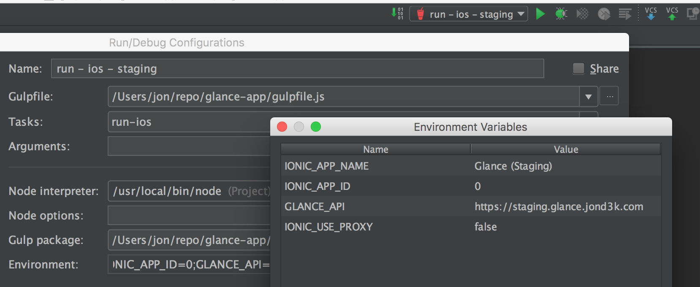
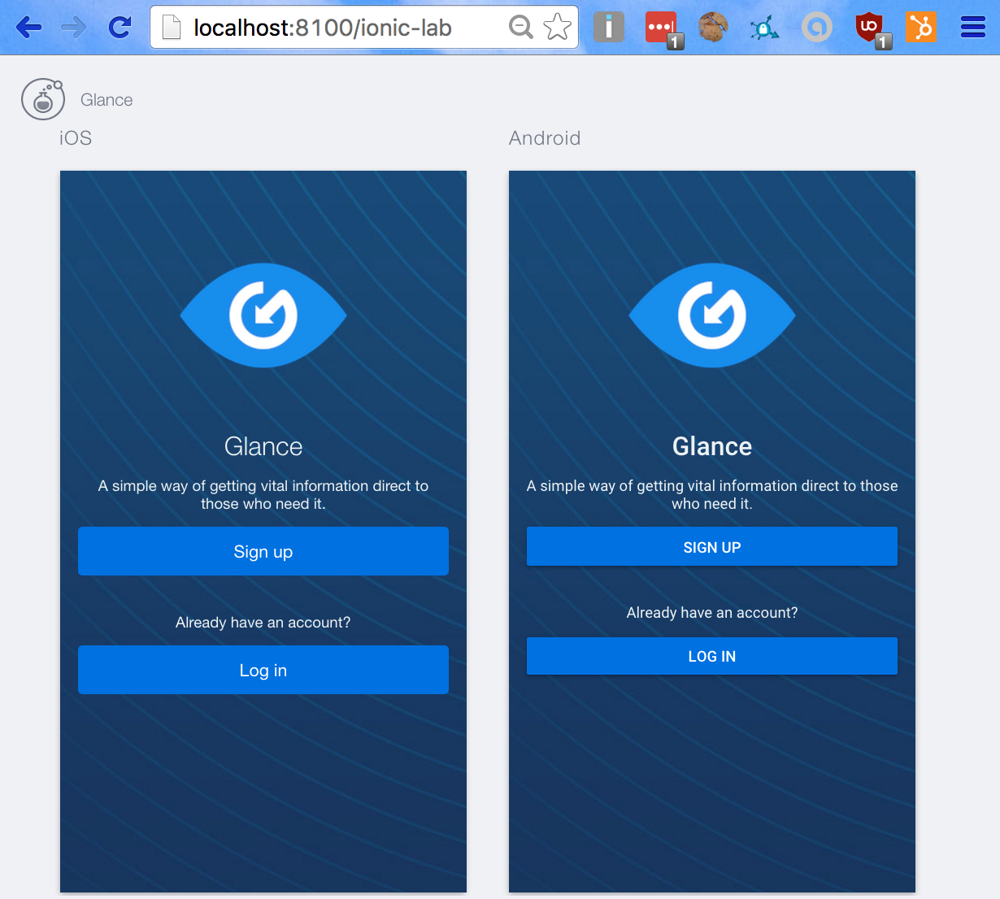

# Getting started

## Installing dependencies

There are a few global dependencies that need to be installed:

	npm install -g cordova gulp typescript typings ionic

Now install the local dependencies:

	npm install

The project uses typescript. Install typescript dependencies with the following command:

	typings install

## Configuration

Many of the gulp tasks create `app/providers/config.ts`, `ionic.config.json` and `ionic.project` but before these files are created a number of environment variables are needed: 

* __IONIC\_APP\_NAME__ is the name of the ionic.io application. This can be anything
* __IONIC\_APP\_ID__ is the name of the ionic.io
* __GLANCE\_API__ is the URL to the proxy server
* __IONIC\_USE\_PROXY__ is set to 'true' to enable Ionic' built-in proxy server to solve CORS issues when running in browser mode

To make this simple you can set up the envs in your IDE or create a separate bash script:

## Running locally

Environment variables are read by the `gulp configure` process to generate the configuration file that is used by the app.

In development mode you will set the following environment variables:

	export IONIC_APP_NAME="Glance (local)"
	export IONIC_APP_ID=0
	export GLANCE_API="http://localhost:8080"
	export IONIC_USE_PROXY=true
	gulp watch
	
Now `ionic serve` can be used to make it available at `localhost:8100`:
	
	ionic serve --lab -c -s

You can now open the app in your browser:

## Running locally, using staging API

You can target the staging server by using these environment variables instead:

	export GLANCE_API="https://staging.glance.jond3k.com/"
	export IONIC_USE_PROXY=true
	gulp watch
	
## Running on iOS simulator

You need to disable the proxy server if you're running on a real device. This will start the simulator using the default target device:

	export GLANCE_API="http://localhost:8080"
	export IONIC_USE_PROXY=false
	gulp run-ios
	
## Running on an iOS simulator, custom target

	export GLANCE_API="http://localhost:8080"
	export IONIC_USE_PROXY=false
	gulp build-platform
	ionic run --target="iPhone-5s, 9.3" ios -s -c

## Running on Android

The steps for running on Android are identical except the `gulp run-android` task is used.

# Releases and deployments

Docker and gocd are used for real builds. Please never attempt to make a manual release.

